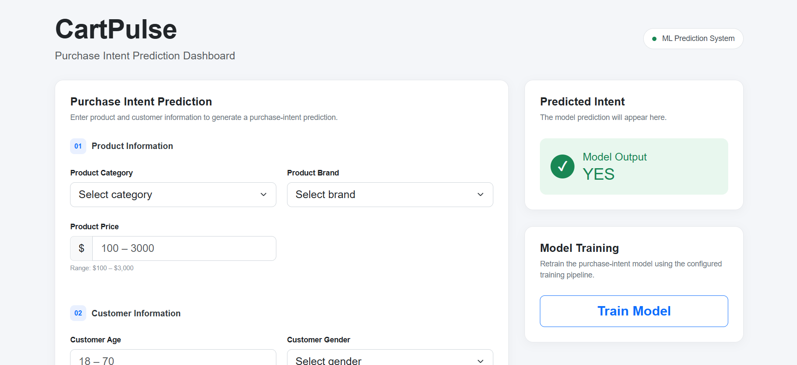

# CartPulse: Customer Intent Predictor — End-to-End MLOps

An end-to-end **MLOps project** for predicting customer purchase intent using an **XGBoost classifier**. The project covers data ingestion, validation, transformation, model training and evaluation, model management, prediction, API development, containerization, and AWS-based CI/CD deployment.



---

## Tech Stack

**Machine Learning**

* Python
* Pandas / NumPy
* Scikit-learn
* XGBoost

**Data & Cloud**

* MongoDB Atlas
* Amazon S3
* Amazon ECR
* Amazon EC2
* AWS IAM / Boto3

**Application & DevOps**

* FastAPI
* HTML / CSS / Bootstrap
* Docker
* GitHub Actions / CI-CD
* Self-hosted GitHub Actions Runner

---

## Project Architecture

```text
MongoDB Atlas
      │
      ▼
Data Ingestion
      │
      ▼
Data Validation
      │
      ▼
Data Transformation
      │
      ▼
XGBoost Model Training
      │
      ▼
Model Evaluation
      │
      ▼
Model Pusher ───────► Amazon S3
                         │
                         ▼
                  Prediction Pipeline
                         │
                         ▼
                      FastAPI
                         │
                         ▼
                   HTML / CSS UI
```

### CI/CD

```text
GitHub
   │
   ▼
GitHub Actions
   │
   ├── CI → Build Docker Image
   │
   ▼
Amazon ECR
   │
   ▼
AWS EC2
   │
   ▼
Docker Container
   │
   ▼
FastAPI Application
```

---

## ML Pipeline

The training pipeline is implemented using an **OOP-based modular architecture**, where each component is responsible for a specific stage and generates its own artifacts.

### 1. Data Ingestion

* Connects to MongoDB Atlas
* Retrieves the dataset
* Creates train/test splits
* Saves the resulting datasets as artifacts

### 2. Data Validation

Validates the incoming dataset by checking:

* Expected number of columns
* Presence of required columns

### 3. Data Transformation

* Removes ID columns
* Encodes categorical features using one-hot encoding
* Renames columns where required
* Scales numerical features
* Saves transformation artifacts for reuse during prediction

### 4. Model Training

Trains an **XGBoost Classifier** using the transformed training data.

### 5. Model Evaluation

Evaluates the trained model on the test dataset and compares its performance with the existing model stored in S3.

### 6. Model Pusher

Using **Boto3**, the pipeline pushes the newly trained model to Amazon S3 **only when it performs better than the existing model**.

---

## Prediction Pipeline

The prediction pipeline loads the current model from Amazon S3 and applies the same preprocessing required for inference.

```text
User Input
    ↓
FastAPI
    ↓
Prediction Pipeline
    ↓
Model + Preprocessor from S3
    ↓
XGBoost Prediction
    ↓
Purchase Intent
```

A simple dashboard was created using **FastAPI, HTML, CSS and Bootstrap** for entering customer and product information and displaying the predicted intent.


## CI/CD

GitHub Actions is used to automate the deployment workflow.

### Continuous Integration

On a successful CI run:

1. The project environment is prepared.
2. The Docker image is built.
3. The image is pushed to **Amazon ECR**.

### Continuous Deployment

The deployment process uses a **GitHub Actions self-hosted runner on AWS EC2** to:

1. Pull the Docker image from ECR.
2. Run the container.
3. Start the FastAPI application.

---

## Setup

### 1. Create a virtual environment

```bash
python -m venv venv
```

Activate it:

**Windows**

```bash
venv\Scripts\activate
```

**Linux/macOS**

```bash
source venv/bin/activate
```

### 2. Install the project

```bash
pip install -e .
```

### 3. Run the ML pipeline

```bash
python demo.py
```

This executes the end-to-end training pipeline:

```text
MongoDB → Ingestion → Validation → Transformation
→ Training → Evaluation → Model Pusher → S3
```

### 4. Run the application

```bash
python app.py
```

This starts the FastAPI prediction application.

## Author

- **Name:** Adarsh Potanpalli
- **Email:** [p.adarsh.24072001@gmail.com](mailto:p.adarsh.24072001@gmail.com)